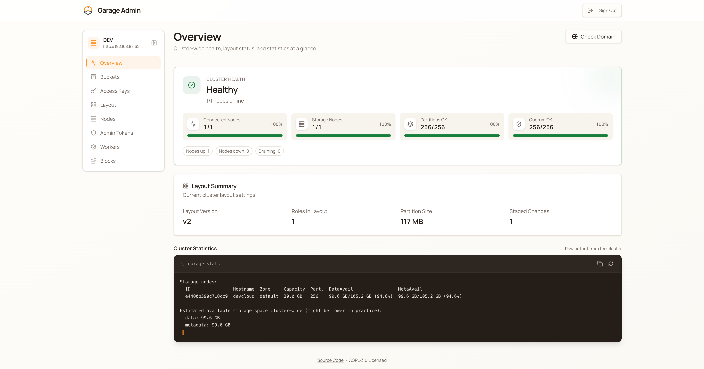
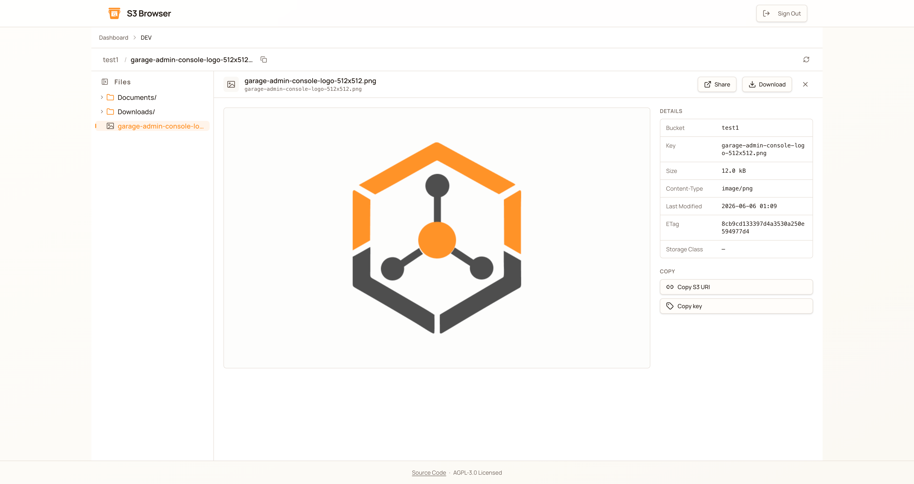
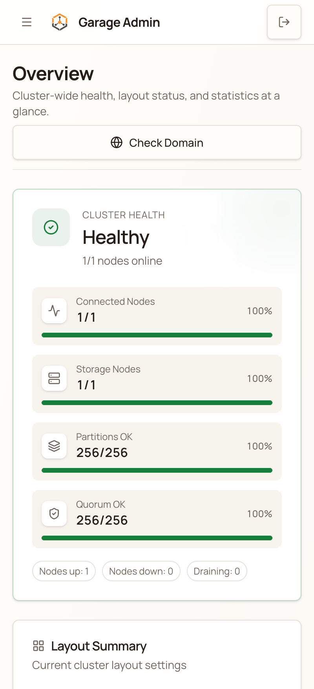
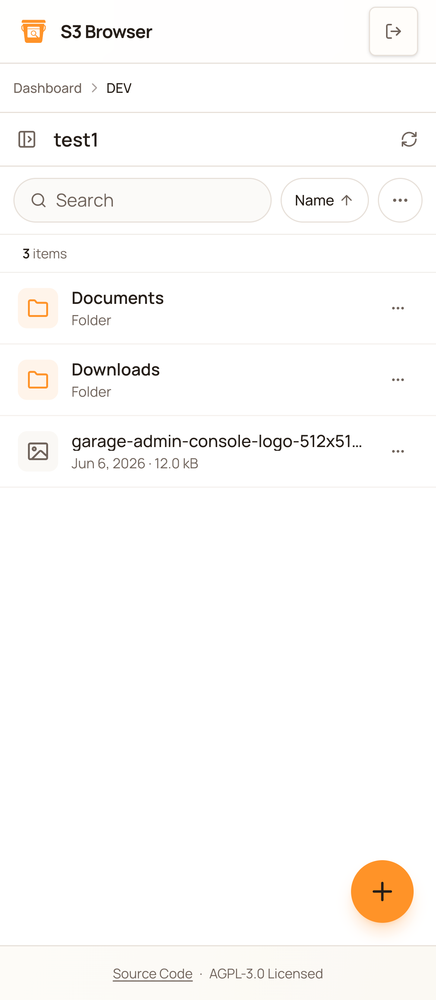

# Garage Admin Console

[English](./README.md) | [中文](./README_zh.md)

一个现代化的 Web 管理界面，用于管理 [Garage](https://garagehq.deuxfleurs.fr/) 分布式对象存储集群。通过统一的仪表盘监控集群健康状态、管理存储桶和访问密钥、配置布局，**并通过嵌入式 S3 文件浏览器直接浏览和上传对象**。

> 兼容 Garage Admin API v2。
>
> **版本说明**：Admin Console 的主版本号与 Garage Admin API 版本保持同步，v2.x 对应 Admin API v2（没有 v1.0 或 v0.x，本项目创建时 Admin API v1/v0 均已废弃）。S3 Browser 镜像按独立的版本线发布。

## 功能特性

- **多集群管理** - 在单一界面中连接和管理多个 Garage 集群
- **仪表盘概览** - 实时集群健康状态、节点状态和容量可视化
- **存储桶管理** - 创建、配置和删除存储桶，支持配额和网站托管
- **嵌入式对象浏览器** - 在任意桶内浏览、上传、签发预签名链接、删除对象，由联邦化的 S3 Browser 模块提供
- **访问密钥管理** - 生成、导入和管理 S3 兼容访问密钥，支持细粒度读/写/所有者权限矩阵
- **节点 / 布局 / 数据块 / Worker 操作** - 监控节点、暂存布局变更、重试数据块同步、调优后台 Worker
- **管理令牌管理** - 管理具有作用域权限的 API 令牌
- **安全凭证存储** - 使用 AES-256-GCM 加密存储 Garage 管理令牌与 S3 密钥

## 截图

| 集群概览 | S3 文件浏览器 |
| --- | --- |
|  |  |
|  |  |

更多截图见 **[screenshots/README.md](./screenshots/README.md)**。

## 快速开始（Docker）

Admin Console 与 S3 Browser 以可组合的镜像发布 —— 可单独运行 Admin、单独运行 S3 Browser、两者合并部署（Admin 代理嵌入的浏览器，仅需发布 Admin 端口），或使用一体化的 `garage-admin-all` 单镜像（Admin 与嵌入式浏览器打包进一个容器，同源伺服）。

```bash
git clone https://github.com/eyebrowkang/garage-admin-console.git
cd garage-admin-console

cp docker/.env.compose.example docker/.env
# 编辑 docker/.env — 启动前替换所有 secret
docker compose -f docker/docker-compose.yml --env-file docker/.env up -d --build
```

Admin 访问地址为 **http://localhost:3001**。单镜像构建、生产环境变量、以及全部 Compose 选项见 **[docs/deployment_zh.md](./docs/deployment_zh.md)**。

## 架构（简述）

采用 Backend-For-Frontend（BFF）代理模式 —— 前端从不直接与 Garage / S3 通信：

```
浏览器 → Admin Web ──→ Admin BFF ──→ Garage 集群 Admin API
                                  └─→ Garage S3 端点（按桶签发临时密钥）
        └─→ （联邦）S3 Browser FileBrowser 远端
```

凭证均以 AES-256-GCM 加密存储；两个 BFF 实现同一套 **Bucket Backend API**，因此同一个 `FileBrowser` 可对接任一后端。完整细节见 **[docs/architecture.md](./docs/architecture.md)**。

## 从源码开发

```bash
pnpm install
cp garage-admin-console/api/.env.example garage-admin-console/api/.env
pnpm dev          # Admin api :3001 + web :5173
```

完整环境配置、嵌入式 FileBrowser 开发流程与排错见 **[docs/development.md](./docs/development.md)**。

## 文档

| 文档 | 内容 |
| --- | --- |
| [docs/architecture.md](./docs/architecture.md) | 系统设计、两个产品 + BFF、Module Federation、数据库结构 |
| [docs/development.md](./docs/development.md) | 本地环境、env、开发服务、常见任务、排错 |
| [docs/bucket-api.md](./docs/bucket-api.md) | 共享的 Bucket Backend API 契约 + 一致性测试套件 |
| [docs/testing.md](./docs/testing.md) | 测试策略、覆盖率、离线 vs. 实机 |
| [docs/deployment_zh.md](./docs/deployment_zh.md) | Docker 镜像、生产环境变量、Compose |
| [CONTRIBUTING.md](./CONTRIBUTING.md) | 分支、Conventional Commits、版本、代码风格 |
| [AGENTS.md](./AGENTS.md) | 面向 Agent 的仓库导览 |

## 安全注意事项

- 生产环境部署在带 HTTPS 的反向代理之后。
- 为每个 BFF 的 `JWT_SECRET`、`ENCRYPTION_KEY`、`ADMIN_PASSWORD` 使用强且唯一的值。
- 控制台面向内部网络部署；生产环境建议增加额外认证层（VPN、SSO）。

## 许可证

本项目采用 GNU Affero 通用公共许可证 v3.0（AGPL-3.0）授权，与 Garage 项目保持一致。完整条款见 [`LICENSE`](./LICENSE)。

`garage-admin-console/web/public/` 与 `s3-browser/web/public/` 下的 Logo 资源版权归 [eyebrowkang](https://github.com/eyebrowkang) 所有，随本项目以 AGPL-3.0 发布。`garage-admin-console/web/public/garage-admin-v2.json` 中的 OpenAPI 规范来源于 [Garage 项目](https://git.deuxfleurs.fr/Deuxfleurs/garage)，受其自身许可条款约束。
