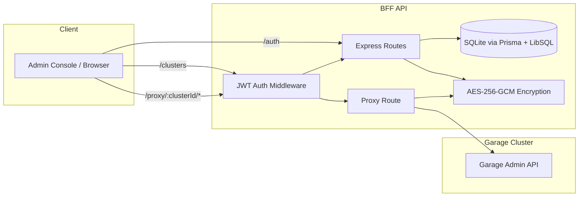

# Garage Admin Console - API

Backend-For-Frontend (BFF) service for Garage Admin Console.

**Tech Stack**: Express 5, TypeScript, Prisma, SQLite/LibSQL, Zod, Axios, Pino, Morgan

## Architecture (API Only)



## Development

```bash
pnpm -C api dev        # Start dev server (http://localhost:3001)
pnpm -C api build      # Compile TypeScript
pnpm -C api start      # Run compiled code
pnpm -C api typecheck  # Type check without emit
pnpm -C api lint       # Lint code
```

## Database

```bash
pnpm -C api db:push    # Push schema to database
pnpm -C api db:studio  # Open Prisma Studio
pnpm -C api db:seed    # Run seed script
```

After schema changes, regenerate the Prisma client:

```bash
pnpm -C api npx prisma generate
```

## Configuration

Copy `.env.example` to `.env` and configure. See `.env.example` for all available variables. `JWT_SECRET`, `ENCRYPTION_KEY`, and `ADMIN_PASSWORD` are required.

In development, the database is stored at `api/data.db`. In production (Docker), the `DATA_DIR` environment variable controls the database directory (defaults to `/data`).

## Documentation

See [DEVELOPMENT.md](../DEVELOPMENT.md) for the detailed development guide.
