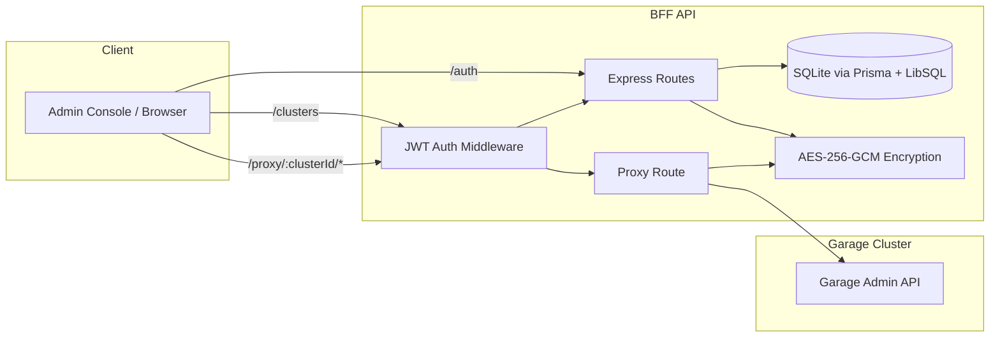

# Garage Admin Console - API

Backend-For-Frontend (BFF) service for Garage Admin Console.

**Tech Stack**: Express 5, TypeScript, Prisma, SQLite/LibSQL, Zod, Axios, Pino, Morgan

## Architecture (API Only)



## Technology Stack

- Runtime: Node.js (ESM)
- Web framework: Express 5
- Validation: Zod
- Auth: JWT (jsonwebtoken)
- Database: SQLite (LibSQL) + Prisma
- Encryption: AES-256-GCM (Node.js crypto)
- HTTP client: Axios (proxying Garage API)
- Logging: Pino (system), Morgan (HTTP)

## Development

```bash
pnpm -C api dev        # Start dev server (http://localhost:3001)
pnpm -C api build      # Compile TypeScript
pnpm -C api start      # Run compiled code
pnpm -C api typecheck  # Type check without emit
pnpm -C api lint       # Lint code
```

## Database

```bash
# Push schema to database
pnpm -C api npx prisma db push

# Open Prisma Studio
pnpm -C api npx prisma studio

# Generate client after schema changes
pnpm -C api npx prisma generate
```

## Configuration

Copy `.env.example` to `.env` and configure (database file is fixed to `data.db`):

```bash
JWT_SECRET="your-secret"
ENCRYPTION_KEY="32-byte-key"
PORT=3001
ADMIN_PASSWORD="your-admin-password"
LOG_LEVEL="info"
MORGAN_FORMAT="dev"
```

`JWT_SECRET`, `ENCRYPTION_KEY`, and `ADMIN_PASSWORD` are required. The API will refuse to start if any are missing.

## Documentation

See [DEVELOPMENT.md](../DEVELOPMENT.md) for detailed development guide including:
- API routes
- Database schema
- Authentication
- Proxy pattern
