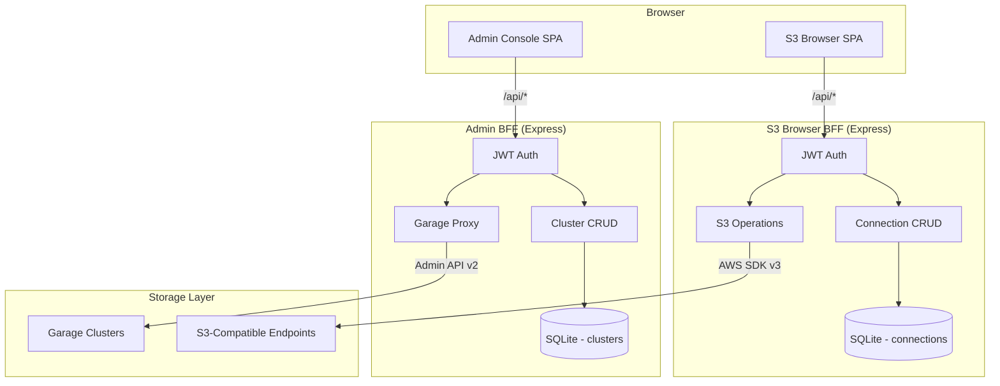
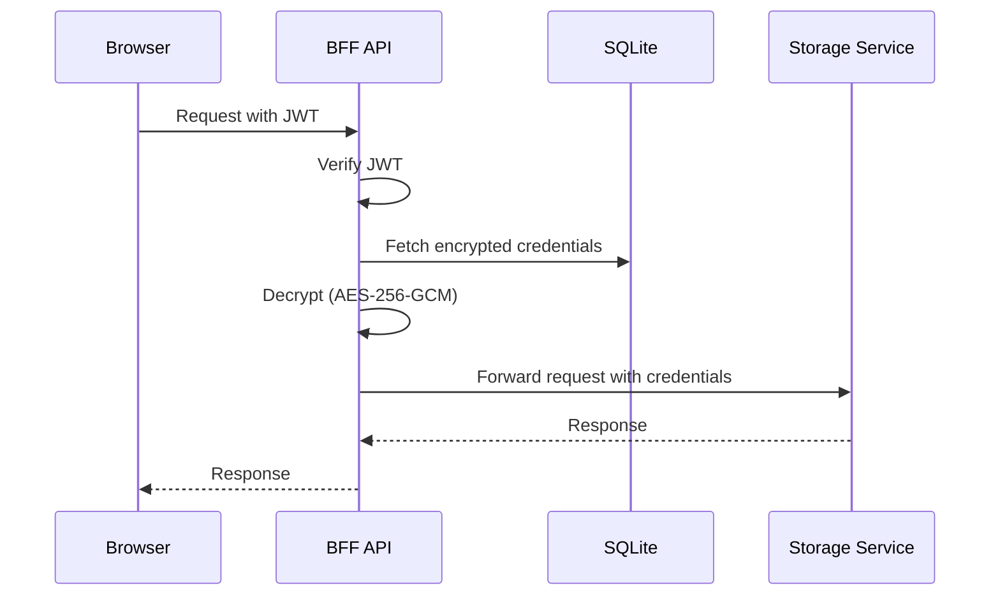

# Architecture

This document describes the system architecture of the Garage Admin Console monorepo.

## Overview

The project is a **monorepo** containing two independent web applications that can be deployed separately or together:

| App               | Purpose                              | API Port | Web Port |
| ----------------- | ------------------------------------ | -------- | -------- |
| **Admin Console** | Garage cluster management            | 3001     | 5173     |
| **S3 Browser**    | S3-compatible object storage browser | 3002     | 5174     |

Both apps follow the **Backend-For-Frontend (BFF) proxy pattern** — the browser never communicates directly with backend storage services.

## System Diagram



## BFF Proxy Pattern

Both apps use the same security model: credentials are stored encrypted in the backend database and only decrypted in memory when proxying requests. The frontend never handles raw credentials.



### Admin Console Flow

```
Browser → POST /api/auth/login (password) → JWT
Browser → GET /api/clusters → Cluster list (tokens excluded)
Browser → ALL /api/proxy/:clusterId/* → BFF decrypts admin token → Garage Admin API v2
```

### S3 Browser Flow

```
Browser → POST /api/auth/login (password) → JWT
Browser → GET /api/connections → Connection list (secrets excluded)
Browser → GET /api/s3/:connectionId/buckets → BFF decrypts access key → S3 ListBuckets
Browser → POST /api/s3/:connectionId/objects/upload → Streaming multipart → S3 PutObject
```

## Monorepo Structure

```
garage-admin-console/
├── apps/
│   ├── admin/
│   │   ├── api/          # Admin BFF — Express 5, Drizzle ORM, SQLite
│   │   └── web/          # Admin SPA — React 19, Vite (MF Host)
│   └── s3-browser/
│       ├── api/          # S3 Browser BFF — Express 5, AWS SDK v3, SQLite
│       └── web/          # S3 Browser SPA — React 19, Vite (MF Remote)
├── packages/
│   ├── auth/             # Shared JWT middleware factory
│   ├── ui/               # Shared UI components (shadcn/ui)
│   └── tsconfig/         # Shared TypeScript configs
├── docker/               # Dockerfiles for 3 deployment modes
├── docs/                 # Documentation
└── e2e/                  # Playwright E2E tests
```

## Shared Packages

### @garage-admin/auth

JWT authentication middleware factory. Both apps use this with their own `JWT_SECRET`:

```ts
import { createAuthMiddleware } from '@garage-admin/auth';
const authenticateToken = createAuthMiddleware({ secret: env.jwtSecret });
```

### @garage-admin/ui

Shared UI primitives built on shadcn/ui and Radix UI: `Button`, `Card`, `InlineStatus`, `cn()` utility, etc.

### @garage-admin/tsconfig

Base TypeScript configurations:

- `base.json` — Strict mode, common settings
- `react.json` — Extends base + JSX, DOM lib
- `node.json` — Extends base + Node types

## Authentication

Both apps use the same auth pattern:

1. A single `ADMIN_PASSWORD` environment variable is the login credential
2. On successful login, the server issues a JWT (24h expiry)
3. All subsequent requests include the JWT in the `Authorization: Bearer <token>` header
4. 401/403 responses trigger automatic redirect to login

## Credential Encryption

Sensitive data (Garage admin tokens, S3 access keys) is encrypted at rest using **AES-256-GCM**:

- `ENCRYPTION_KEY` (exactly 32 ASCII characters) is the encryption key
- Each value is encrypted with a random IV
- Stored format: `iv:authTag:ciphertext` (hex-encoded)
- Decryption only happens in-memory during request proxying

## Database

Each app has its own SQLite database managed by Drizzle ORM with LibSQL:

| App        | Database        | Tables                     |
| ---------- | --------------- | -------------------------- |
| Admin      | `data.db`       | `clusters`, `app_settings` |
| S3 Browser | `s3-browser.db` | `connections`              |

Migrations run automatically on startup — no manual migration step needed.

## Module Federation

The Admin Console (host) can embed S3 Browser components (remote) via `@module-federation/vite`. See [Module Federation Guide](./module-federation.md) for details.
