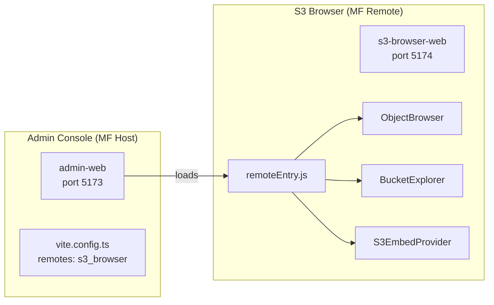
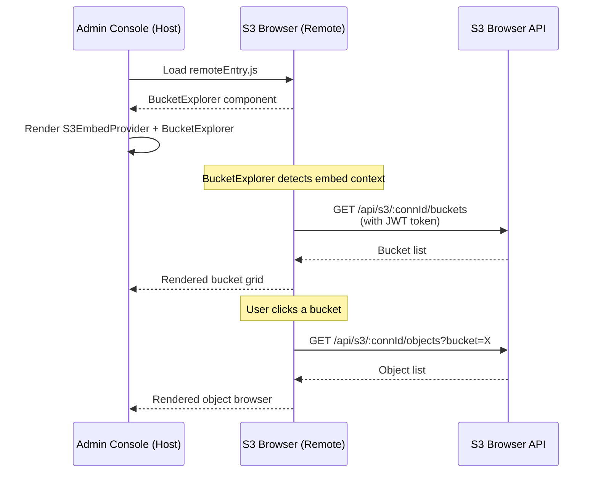
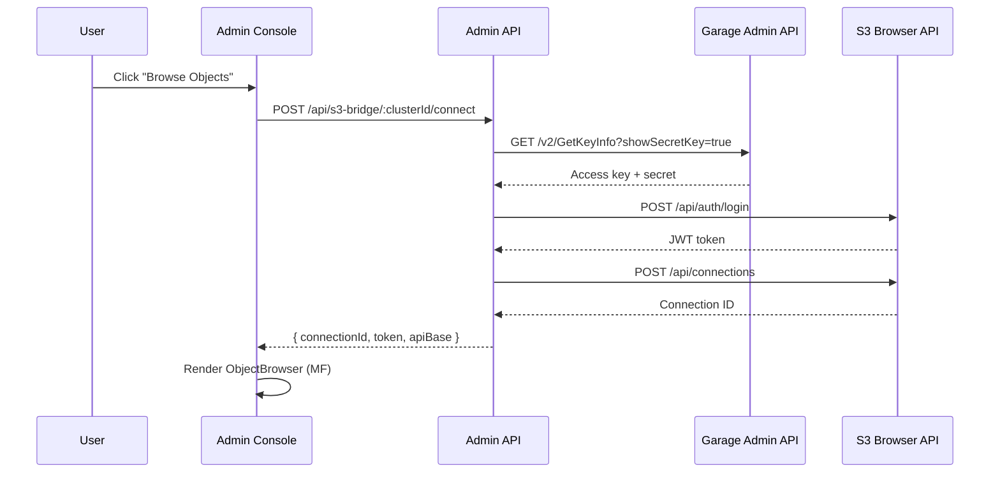

# Module Federation Guide

The Admin Console (host) can embed S3 Browser components (remote) via [Module Federation](https://module-federation.io/), powered by `@module-federation/vite`.

## Architecture



## Exposed Components

The S3 Browser remote exposes three components:

| Export | Component | Description |
|--------|-----------|-------------|
| `./ObjectBrowser` | `ObjectBrowser` | Object listing with folder navigation, download, delete |
| `./BucketExplorer` | `BucketExplorer` | Bucket list → object browser drill-down flow |
| `./S3EmbedProvider` | `S3EmbedProvider` | Context provider that supplies S3 connection config |

### S3EmbedProvider Config

```ts
interface S3EmbedConfig {
  apiBase: string;       // S3 Browser API URL (e.g. "http://localhost:3002/api")
  connectionId: string;  // UUID of the S3 connection to use
  bucket?: string;       // Pre-selected bucket (skip bucket list)
  readonly?: boolean;    // Disable upload/delete operations
  token?: string;        // JWT token for authentication
}
```

## Shared Singletons

These libraries are shared between host and remote to avoid duplicate instances:

- `react` (^19.0.0)
- `react-dom` (^19.0.0)
- `react-router-dom` (^7.0.0)
- `@tanstack/react-query` (^5.0.0)

## Usage in Host App

### 1. Import Remote Components

```tsx
import React, { Suspense } from 'react';

// Lazy-load remote components
const RemoteS3EmbedProvider = React.lazy(() =>
  import('s3_browser/S3EmbedProvider').then((m) => ({ default: m.S3EmbedProvider }))
);

const RemoteBucketExplorer = React.lazy(() =>
  import('s3_browser/BucketExplorer').then((m) => ({ default: m.BucketExplorer }))
);

const RemoteObjectBrowser = React.lazy(() =>
  import('s3_browser/ObjectBrowser').then((m) => ({ default: m.ObjectBrowser }))
);
```

### 2. Render with Provider

```tsx
<Suspense fallback={<div>Loading S3 Browser...</div>}>
  <RemoteS3EmbedProvider
    config={{
      apiBase: 'http://localhost:3002/api',
      connectionId: 'uuid-of-connection',
      token: 'jwt-token-from-s3-browser',
      bucket: 'my-bucket',        // optional
      readonly: false,             // optional
    }}
  >
    <RemoteBucketExplorer />
    {/* or <RemoteObjectBrowser /> for a single bucket */}
  </RemoteS3EmbedProvider>
</Suspense>
```

### 3. Type Declarations

The host app needs type declarations for remote imports. These are defined in `apps/admin/web/src/types/s3-browser.d.ts`:

```ts
declare module 's3_browser/ObjectBrowser' {
  export const ObjectBrowser: React.FC;
}

declare module 's3_browser/BucketExplorer' {
  export const BucketExplorer: React.FC;
}

declare module 's3_browser/S3EmbedProvider' {
  export interface S3EmbedConfig {
    apiBase: string;
    connectionId: string;
    bucket?: string;
    readonly?: boolean;
    token?: string;
  }
  export const S3EmbedProvider: React.FC<{
    config: S3EmbedConfig;
    children: React.ReactNode;
  }>;
}
```

## Data Flow



## Development

### Running Both Apps

Both the host and remote must be running during development:

```bash
# Start all 4 dev servers (recommended)
pnpm dev

# Or start individually
pnpm dev:admin    # Admin API (3001) + Web (5173)
pnpm dev:s3       # S3 Browser API (3002) + Web (5174)
```

The host's Vite config points to the remote's dev server:

```ts
// apps/admin/web/vite.config.ts
remotes: {
  s3_browser: {
    type: 'module',
    name: 's3_browser',
    entry: 'http://localhost:5174/remoteEntry.js',
  },
}
```

### Embedded Components Are Self-Contained

The remote components include their own `QueryClientProvider`, so they work regardless of whether the host provides one. They fetch data independently using the `apiBase` and `token` from the embed config.

### Testing Embedded Mode

The Admin Console includes a test page at `/s3-test` that lets you:

1. Enter the S3 Browser API base URL
2. Provide a JWT token (obtained by logging into S3 Browser)
3. Specify a connection ID
4. Optionally pre-select a bucket

This loads `BucketExplorer` via Module Federation and renders it in the Admin Console.

### Integrated Object Browsing

The Admin Console's **Bucket Detail** page includes a built-in Object Browser section that provides seamless integration between the two apps:

1. Open a bucket detail page in the Admin Console
2. In the **Object Browser** card, select an access key with read permission
3. Click **Browse Objects** — the system automatically:
   - Retrieves the key's secret via the Garage Admin API
   - Creates (or reuses) an S3 Browser connection
   - Embeds the `ObjectBrowser` component via Module Federation
4. If the key has write permission, upload/delete operations are enabled



**Required environment variables** (Admin API):

| Variable | Description | Default |
|----------|-------------|---------|
| `S3_BROWSER_API_URL` | S3 Browser API URL (e.g. `http://localhost:3002/api`) | — |
| `S3_BROWSER_ADMIN_PASSWORD` | S3 Browser login password | Falls back to `ADMIN_PASSWORD` |

## Production Deployment

### Combined Image (Recommended)

In the combined Docker image (`docker/combined.Dockerfile`), S3 Browser's remote assets (`remoteEntry.js`, etc.) are served from `/s3-browser/` on the same origin as the Admin Console. This avoids CORS issues.

The Express server handles route priority:

```
1. /api/*           → Admin BFF routes
2. /s3-browser/*    → S3 Browser remote assets (remoteEntry.js, chunks)
3. /*               → Admin SPA (index.html fallback)
```

### Side-by-Side Deployment

When deploying separately, the host needs the remote's `remoteEntry.js` URL. Update the host's MF config to point to the deployed S3 Browser URL:

```ts
remotes: {
  s3_browser: {
    entry: 'https://s3-browser.example.com/remoteEntry.js',
  },
}
```

> **Note:** Ensure CORS headers are configured on the S3 Browser server if deploying on different origins.
