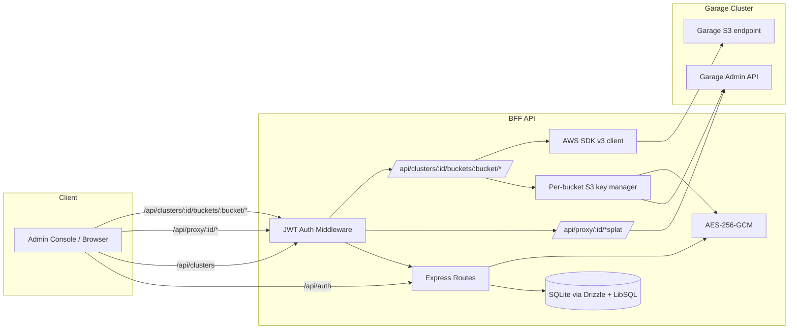

# @garage-admin/api

Backend-For-Frontend (BFF) for the Garage Admin Console.

**Tech stack**: Express 5, TypeScript, Drizzle ORM, SQLite/LibSQL, Zod, Axios, Pino, Morgan, `@aws-sdk/client-s3`, busboy.

## What it does

- Stores Garage cluster connection info (`endpoint`, `adminToken`, optional `metricToken`, and the optional S3-protocol surface `s3Endpoint` / `s3Region` / `s3ForcePathStyle`).
- Encrypts `adminToken` and `metricToken` at rest with AES-256-GCM ([`src/encryption.ts`](src/encryption.ts)).
- Proxies the Garage Admin API v2 (`ALL /api/proxy/:clusterId/*splat`) — the admin token is decrypted in memory per-request and the JSON body is forwarded.
- Implements the **Bucket Backend API** under `/api/clusters/:clusterId/buckets/:bucket/*`. The federated `s3Browser/FileBrowser` component embedded inside the Admin BucketDetail page talks to this surface.

## Architecture



## Endpoints

| Path                                                                                                 | Auth | Purpose                                                            |
| ---------------------------------------------------------------------------------------------------- | ---- | ------------------------------------------------------------------ |
| `POST /api/auth/login`                                                                               | none | Exchange password → JWT                                            |
| `GET /api/health`                                                                                    | none | Health check                                                       |
| `GET/POST /api/clusters`                                                                             | JWT  | List / add clusters (tokens excluded from list responses)          |
| `PUT/DELETE /api/clusters/:id`                                                                       | JWT  | Update / remove a cluster                                          |
| `ALL /api/proxy/:clusterId/*splat`                                                                   | JWT  | Pass-through to Garage Admin API (admin token decrypted in memory) |
| `GET/POST/DELETE /api/clusters/:clusterId/buckets/:bucket/{list,object,presign,upload,objects,copy}` | JWT  | Bucket Backend API                                                 |

## Per-bucket S3 key minting

In embedded mode the Bucket Backend API never touches stored long-lived S3 keys. Instead [`src/lib/garage-keys.ts`](src/lib/garage-keys.ts) calls Garage's `CreateKey + AllowBucketKey` admin endpoints using the cluster's stored admin token, then caches the resulting `{ accessKeyId, secretAccessKey }` per `(clusterId, bucketName)` in process memory with a 10-minute TTL. On restart the cache is empty and the next request re-mints.

## Development

```bash
pnpm -C garage-admin-console/api dev        # tsx watch — http://localhost:3001
pnpm -C garage-admin-console/api build      # compile TypeScript
pnpm -C garage-admin-console/api start      # run compiled code
pnpm -C garage-admin-console/api typecheck  # tsc --noEmit
pnpm -C garage-admin-console/api lint
```

## Database

```bash
pnpm -C garage-admin-console/api db:generate   # generate migration SQL from schema diff
pnpm -C garage-admin-console/api db:push       # push schema directly (dev only)
pnpm -C garage-admin-console/api db:seed       # run seed script
pnpm -C garage-admin-console/api db:studio     # open Drizzle Studio
```

Schema in [`src/db/schema.ts`](src/db/schema.ts):

- **`Cluster`** — `id, name, endpoint, adminToken (enc), metricToken (enc, opt), s3Endpoint (opt), s3Region (opt), s3ForcePathStyle (opt), createdAt, updatedAt`
- **`AppSettings`** — key/value store

Migrations in [`drizzle/`](drizzle/) run automatically on startup via [`src/db/migrate.ts`](src/db/migrate.ts). Current migration set: `0000_init.sql` + `0001_curious_purple_man.sql` (the `s3*` columns).

## Configuration

Copy `.env.example` to `.env`. `JWT_SECRET`, `ENCRYPTION_KEY`, and `ADMIN_PASSWORD` are required (validated in [`src/config/env.ts`](src/config/env.ts)).

In dev the database is stored at `garage-admin-console/api/data.db`. In Docker the `DATA_DIR` env var (defaults to `/data`) controls the location.

## Conformance

Run the shared `@garage/bucket-api-contract-tests` suite against this BFF:

```bash
export TEST_BFF_URL=http://localhost:3001/api
export TEST_BFF_PASSWORD=admin
export TEST_BFF_FLAVOR=clusters
export TEST_CLUSTER_ID=<cluster id from /api/clusters>
export TEST_S3_BUCKET=s3-browser-test   # must exist; cluster's s3Endpoint must be set
pnpm -C packages/bucket-api-contract-tests test:run
```

## Documentation

See the [`docs/`](../../docs/) guides — start with
[architecture.md](../../docs/architecture.md) and [development.md](../../docs/development.md).
