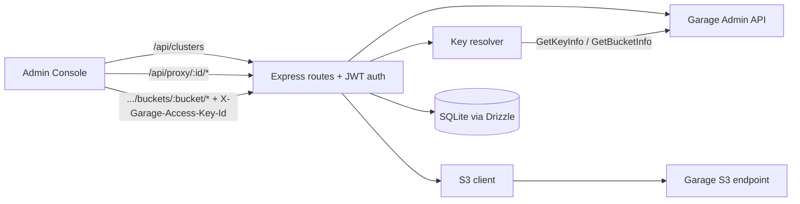

# @garage-admin/api

Backend-For-Frontend (BFF) for the Garage Admin Console — Express 5 + Drizzle/SQLite.

**Tech stack:** Express 5, TypeScript, Drizzle ORM + SQLite, Zod, Axios, Pino + Morgan, busboy. (S3 access comes through `@garage/bucket-api-server`'s `getCachedS3Client`, not a direct `@aws-sdk/*` dependency.)

## What it does

- Stores Garage cluster connection info — `endpoint`, encrypted `adminToken`, optional `metricToken`, and the optional S3 surface `s3Endpoint` / `s3Region` / `s3ForcePathStyle`. Credentials are encrypted at rest via `@garage/crypto`.
- Proxies the Garage Admin API v2 (`ALL /api/proxy/:clusterId/*splat`) — the admin token is decrypted in memory per request.
- Implements the shared **[Bucket Backend API](../../docs/bucket-api.md)** under `/api/clusters/:clusterId/buckets/:bucket/*` (via `@garage/bucket-api-server`), which the embedded `s3Browser/FileBrowser` talks to.

Full routes, schema, and the complete endpoint list live in
[docs/architecture.md](../../docs/architecture.md#admin-bff) and
[docs/bucket-api.md](../../docs/bucket-api.md).

## Host-selected S3 key resolution (admin-only)

In embedded mode the Bucket Backend API does **not** create keys. The host UI picks an existing access key authorized on the bucket and forwards it as `X-Garage-Access-Key-Id`. [`src/lib/garage-keys.ts`](src/lib/garage-keys.ts) then resolves that key's secret on demand via Garage `GetKeyInfo?showSecretKey=true` (the authorized-key list comes from `GetBucketInfo`), caching the resolved `{ accessKeyId, secretAccessKey }` per `(clusterId, accessKeyId)` in process memory with a 10-minute TTL. On restart the cache is empty and the next request re-resolves.

## Documentation

Local dev, env vars, scripts, and the DB workflow → [docs/development.md](../../docs/development.md).
Architecture (routes + schema) → [docs/architecture.md](../../docs/architecture.md#admin-bff).
The Bucket Backend API + conformance suite → [docs/bucket-api.md](../../docs/bucket-api.md).
